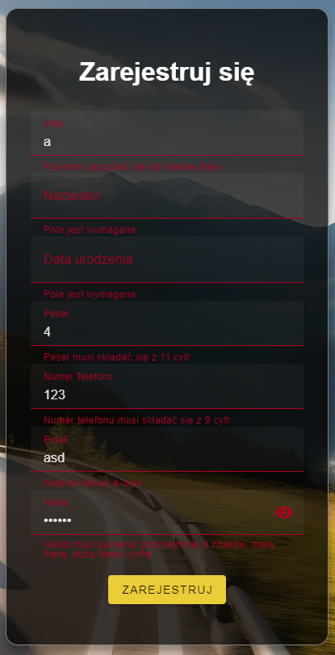

  <h1 align="center">
    Web application for a car rental
  </h1>
  <h2> About the project</h2>
  

    The web application for a car rental company has 4 types of users: 
  <ul>
    <li>guest,</li>
    <li>customer,</li>
    <li>employee,</li>
    <li>administrator, which is the owner of the rental company. </li>
  </ul>
  A guest can register, search for available cars, see possible insurances. A customer has the same capabilities as a guest additionally can log in, complete reservations and manage reservations. An employee can issue or collect a car, extend or reject a rental to a customer. Administrator otherwise the owner has the same capabilities as an employee, in addition he can manage cars, insurance and employees.
  

  
  <h2 align="left">
    Built with
  </h2>

 [![Dotnet][DotnetCore]][Dotnet-url]
 [![CSharp][CSharpLogo]][CSharp-url] 
 [![Vue][Vue.js]][Vue-url] 
 [![MSSQL][MSSQLServer]][MSSQLServer-url]

[DotnetCore]: https://img.shields.io/badge/.NET_Core-5C2D91?style=for-the-badge&logo=.net&logoColor=white
[Dotnet-url]: https://learn.microsoft.com/en-us/aspnet/core/?view=aspnetcore-7.0
[Vue.js]: https://img.shields.io/badge/Vue.js-35495E?style=for-the-badge&logo=vuedotjs&logoColor=4FC08D
[Vue-url]: https://vuejs.org/
[CSharpLogo]: https://img.shields.io/badge/C%23-239120?style=for-the-badge&logo=csharp&logoColor=white
[CSharp-url]: https://learn.microsoft.com/en-us/dotnet/csharp/
[MSSQLServer]: https://img.shields.io/badge/Microsoft%20SQL%20Server-CC2927?style=for-the-badge&logo=microsoft%20sql%20server&logoColor=white
[MSSQLServer-url]: https://www.microsoft.com/en-us/sql-server

## Screenshots

  
  
  
  
   
  
  

